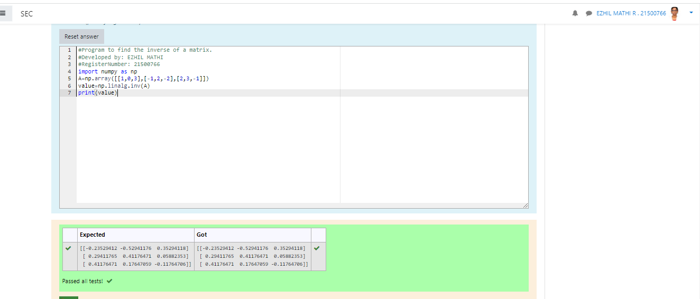

# INVERSE-OF-A-MATRIX
## Aim:
To write a python program to find the inverse of a matrix
## Equipment’s required:
1. 	Hardware – PCs
2. 	Anaconda – Python 3.7 Installation / Moodle-Code Runner
## Algorithm:
### Step1 : 
To find the inverse of matrix by using python programming.
### Step 2: 
Import numpy as the value.
### Step 3:
To find the inverse using inverse format.
### Step 4: 
Print the result.

## Program:
```
#Program to find the inverse of a matrix.
#Developed by: EZHIL MATHI
#RegisterNumber: 21500766
import numpy as np
A=np.array([[1,0,3],[-1,2,-2],[2,3,-1]])
value=np.linalg.inv(A)
print(value)
```
## Output:

## Result:
Thus the inverse of given matrix is successfully solved using python program

